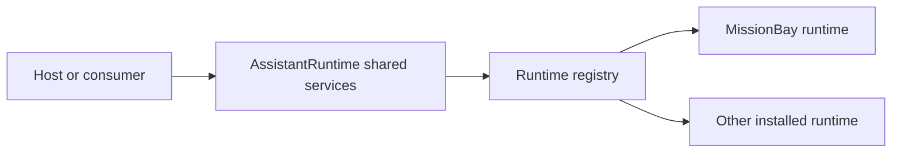

# AssistantRuntime

## Purpose

AssistantRuntime contains the shared concrete runtime composition that must not live in AssistantFoundation.

AssistantFoundation defines contracts. Runtime plugins such as MissionBay implement named runtimes. AssistantRuntime discovers those runtimes and gives consumers one consistent routing layer.



## Responsibilities

AssistantRuntime owns:

* discovery and validation of installed runtimes;
* strict runtime selection;
* generic execution routing;
* generic conversation routing;
* isolated text-task routing;
* aggregation of context-profile providers;
* aggregation of tool-profile providers;
* composition of runtime-specific configuration forms;
* durable suspension storage through `IStateStore`;
* event sink helpers and a collecting sink;
* a shared AI service dashboard display.

It does not implement MissionBay flows, tools, nodes, providers, or orchestration stages.

## Plugin composition

`AssistantRuntimePlugin::init()` registers lazy shared services with `NOOVERWRITE` so a project can replace them deliberately.

The default bindings include:

```text
IAgentContextProfileService -> AgentContextProfileService
IAgentToolProfileService    -> AgentToolProfileService
IAgentSuspensionRepository  -> StateStoreAgentSuspensionRepository
IAgentRuntimeRegistry       -> AgentRuntimeRegistry
IAgentRuntimeSelector       -> StrictAgentRuntimeSelector
IAgentExecutionService      -> RoutingAgentExecutionService
IAgentConversationService   -> RoutingAgentConversationService
IAgentTextTaskService       -> RoutingAgentTextTaskService
IAgentConfigFormService     -> CompositeAgentConfigFormService
```

## Strict runtime selection

The default selector treats the configured runtime id as an explicit choice. It does not route to another runtime when the selected runtime is missing.

A project that deliberately wants a preferred default can use `PreferredAgentRuntimeSelector`, which still inherits the strict validation behavior.

## Runtime capabilities

A runtime can expose four related but separate capabilities:

* normal execution;
* runtime-specific configuration form;
* conversation lifecycle;
* isolated text tasks.

The registry resolves each capability through its own AssistantFoundation interface. Missing optional capabilities fail at that capability boundary.

## Profiles

`AgentContextProfileService` discovers all `IAgentContextProfileProvider` implementations through `IClassMap` and presents one global profile namespace.

`AgentToolProfileService` performs the same aggregation for `IAgentToolProfileProvider` and returns either one tool set or a `CompositeAgentToolSet` when multiple profiles/providers are selected.

Profile ids must remain unambiguous in the aggregate namespace.

## Suspensions

`StateStoreAgentSuspensionRepository` stores pending suspensions, claim leases, replay protection, and scope indexes in `IStateStore`.

The server owns the full suspension. Clients receive only opaque resume handles.

## Configuration UI

`CompositeAgentConfigFormService` delegates runtime-specific form fields to the selected runtime form service while retaining the shared runtime selector.

This is the reason a host can render one agent configuration UI without importing MissionBay form templates directly.

## Documentation

* [overview](docs/overview.md)
* [agent runtime routing](docs/agent-runtime-routing.md)
* [agent tool profiles](docs/agent-tool-profiles.md)
* [context profiles](docs/context-profiles.md)
* [configuration forms](docs/configuration-forms.md)
* [suspensions](docs/suspensions.md)
* [events and diagnostics](docs/events-and-diagnostics.md)
* [API reference](docs/api-reference.md)

## License

GPL-3.0.
