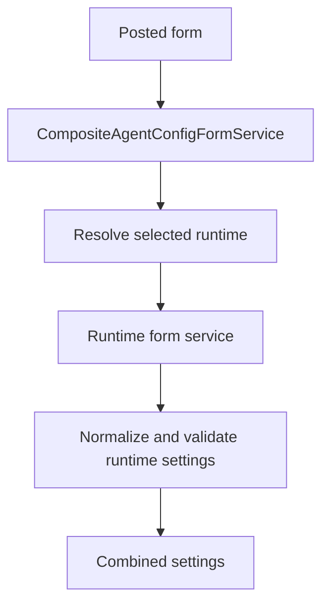

# Agent Configuration Forms

## Purpose

`CompositeAgentConfigFormService` lets one shared administration surface edit multiple runtime-specific agent configurations.

## Shared and runtime-owned fields

AssistantRuntime owns runtime selection. Each runtime owns the fields required to configure itself.

A runtime form implements `IAgentRuntimeConfigFormService` and supplies defaults, normalization, post parsing, view values, a summary, a template, and template data.

## Save flow

## Rendering

The composite form maps stored settings to runtime-specific view values and assigns the selected runtime template data to the shared MVC view.

A generic host should not duplicate MissionBay form parsing logic.

## Errors

Posted settings errors are returned through the caller-provided error array. The runtime id can be supplied explicitly when the caller already knows which runtime form is being posted.
