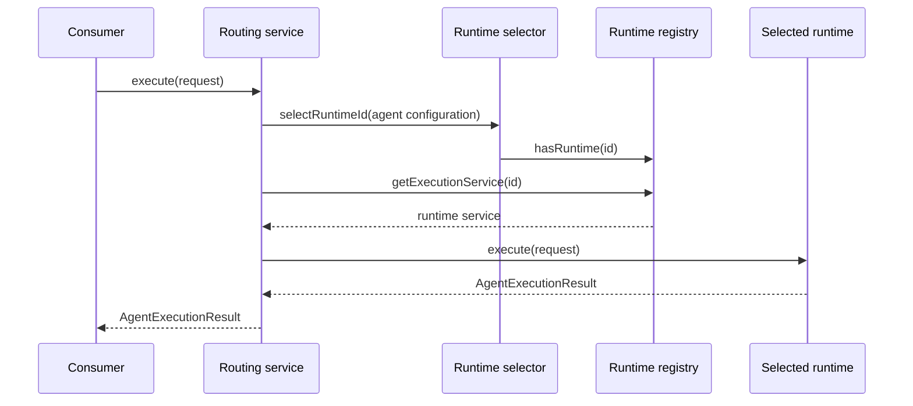

# AssistantRuntime Overview

## Purpose

AssistantRuntime is the shared runtime-composition layer between consumers and named assistant runtimes.

It exists so consumers do not need runtime-specific registries, selectors, routing rules, profile aggregation, or form composition.

## Main flow

The same routing pattern is used for conversations and text tasks with their matching runtime capability interfaces.

## Discovery

The registry uses `IClassMap`, not a hardcoded runtime list. A runtime becomes available by implementing the AssistantFoundation runtime interfaces and exposing a stable runtime id.

## Replaceability

AssistantRuntime registers its default services with `NOOVERWRITE`. Project composition can replace the selector, registry, suspension repository, or profile services without modifying runtime plugins.

## Failure behavior

Selection is strict. Invalid configuration is surfaced at the runtime boundary instead of being hidden by a fallback runtime.

This property is important because different runtimes can have different tools, context, safety policies, and persistence behavior.
